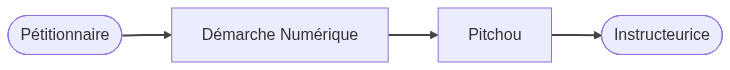

# Différences Démarches Numériques et Pitchou

**Dernière mise à jour : mi-février 2026**

Pitchou (le projet) repose principalement sur deux morceaux techniques : Démarches Numériques (DN) et pitchou.beta.gouv.fr


## État des lieux et futur

L'équipe Pitchou a fait ce choix au début de la [phase de construction](https://doc.incubateur.net/communaute/gerer-son-produit/la-vie-du-produit/construction) pour des raisons techniques/économique : refaire un formulaire prendrait du temps et nous préférons passer ce temps à faire des choses qui ajoutent plus de valeur aux instructrices ()

**À court terme**, nous allons garder cette architecture "bi-céphale". Nous avons conscience de la pénibilité que cette situation transitoire amène aux instructrices

**À moyen terme**, nous allons déplacer le travail d'instruction dans Pitchou afin que les instructeur.rices n'aient plus besoin d'aller sur DN et utilisent exclusivement pitchou.beta.gouv.fr. Nous imaginons que nous en serons à cette étape fin 2026

**À long terme**, nous quitterons DN et les pétitionnaires. Nous n'avons pas de date prévue. Nous attendons d'avoir confiance que pitchou.beta.gouv.fr satisfait une grosse majorité d'instructeur.rices sur l'ensemble de la France


## Cycle de vie d'un dossier

Les pétitionnaires déposent leur dossier DDEP (demandes de dérogation espèces protégées) ou projet de demande [sur DN](http://demarche.numerique.gouv.fr/commencer/derogation-especes-protegees)

Le dossier est transmis automatiquement par Pitchou, puis affiché à l'instructeur.rice (via la liste "Mes dossiers" ou "Tous les dossiers", puis individuellement via l'onglet "Projet" de chaque dossier)

<!--

```mermaid
flowchart LR
    Pétitionnaire([Pétitionnaire])
    DN[Démarche Numérique]
    Pitchou[Pitchou]
    Instructeurice([Instructeurice])

    Pétitionnaire --\> DN
    DN --\> Pitchou
    Pitchou --\> Instructeurice

linkStyle default stroke:#444,stroke-width:2px;
```

-->



Quand un pétitionnaire met à jour son dossier, les éléments mis à jour sont automatiquement transmis à Pitchou

⚠️ **Attention** : la mise à jour entre DN et Pitchou **n'est pas instantanée**. Elle se fait **environ toutes les 15 minutes**. Il est donc possible que les informations sur Pitchou ne soient pas immédiatement mises à jour. Il suffit d'attendre un peu.


## Relation entre DN et Pitchou

### Suivre un dossier

DN et Pitchou proposent tous les deux de suivre un dossier

**Ces fonctionnalités sont complètement séparées et ne sont pas synchronisées.**

Ainsi,
Si vous suivez un dossier sur DN, ce dossier n'est pas suivi sur Pitchou.

Si vous suivez un dossier sur Pitchou, ce dossier n'est pas suivi sur DN.


### Phases

DN a 5 phases :
- en construction
- instruction
- accepté
- classé sans suite
- refusé

Quand on change la phase d'un dossier dans DN, le pétitionnaire reçoit un email de notification

Pitchou a [6 phases](./phases-instructions) : 
- accompagnement amont
- étude recevabilité DDEP
- instruction
- contrôle
- classé sans suite
- obligations terminées

Quand on change la phase d'un dossier dans Pitchou, le pétitionnaire **ne reçoit pas** d'email de notification

Actuellement :
- Les phases **sont synchronisées** de DN vers Pitchou
- Les phases **ne sont pas synchronisées** de Pitchou vers DN

Ainsi, 
si vous passez un dossier en instruction sur DN, il sera passé en instruction sur Pitchou
mais si vous passez un dossier en instruction sur Pitchou, **il restera en construction dans DN** (et le pétitionnaire ne sera pas informé du changement de phase)


### Instruction du dossier

#### Annotations privées

DN possède une fonctionnalité "d'annotations privées" qui sont accessibles uniquement aux instructeur.rices d'un dossier

Par le passé, nous avons utilisé cette fonctionnalité pour permettre aux instructrices de saisir des données liées au travail d'instruction (commentaire libre, numéro Onagre, saisines/avis CNPN/CSRPN). Nous déplaçons progressivement ces fonctionnalités dans Pitchou

D'ici fin 2026, tout se fera directement dans Pitchou


#### Avis 

Si vous demandez un avis CSRPN sur DN via la fonctionnalité dédiée, ni la saisine ni l'avis ne sont actuellement récupérés sur Pitchou

D'ici fin 2026, ces avis seront récupérés dans Pitchou


#### Messagerie

Les échanges qui ont leur sur DN sont récupérés dans Pitchou et rendus accessibles via l'onglet "Échanges" de chaque dossier

Il n'est pas possible de pouvoir répondre à un message depuis Pitchou. Il faut aller sur la messagerie DN pou répondre

L'équipe Pitchou n'a pas encore de position claire sur si nous souhaitons garder/encourager une fonctionnalité de messagerie dans Pitchou. Le travail d'instruction est souvent très lié à l'usage d'emails pour la communication.
Nous avons déjà conscience d'une limitation de la messagerie de DN qui est qu'elle ne permet pas de mettre quelqu'un en copie d'un message facilement

Une option envisagée est de créer une adresse email par dossier, par exemple `dossier-123456@pitchou.beta.gouv.fr`. Cette adresse pourrait être mise en copie de chaque échange avec le pétitionnaire et les messages envoyés à cette adresse seraient affichés dans l'onglet "Échange" du dossier. Si une personne a oublié de mettre l'adresse en copie, n'importe qui peut transférer un email à cette adresse a posteriori. 
L'équipe Pitchou n'a pas encore tranché de faire ou ne pas faire cette option, ni à quelle échéance


