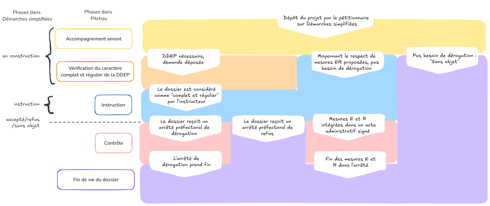

# Phases instructions

## **En régime propre**
Un dossier se trouve dans une des phases suivantes :

- "**Accompagnement amont**"
    - Dès le premier contact au sujet de son projet, le pétitionnaire est invité à renseigner démarche-numériques (DN). Ce dépôt permet de prendre contact et de garer la mémoire du projet dans les tableaux de suivi Pitchou. Aucune information n'est obligatoire à ce stade et ce dépôt ne signifie pas qu'une demande de déogation est nécessaire.
    - Ce dépôt permet d'obtenir une position officielle du service instructeur :
        - Si aucune DDEP n'est nécessaire, l'instructeur passe le dossier en phase "Classé sans suite" dans Pitchou,
        - Si une DDEP est nécessaire, le pétitionnaire complète sa demande, et celle-ci passe en phase "Etude de recevabilité DDEP".
- "**Étude recevabilité DDEP**"
    - Pendant cette phase, le service instructeur évalue le caractère "**complet et régulier**" du dossier et peut demander des compléments. Cette phase vaut surtout pour les dossiers en **Autorisation Environnementale**, dans le cadre de la Loi "Industrie verte".
    - Lorsque l'instructeur estime que le dossier est complet, il le fait passer dans DN en phase...
- "**Instruction**"
    - Le passage en phase d'instruction se fait sous DN, via une action de l'instructeur. **Le dossier ne peut alors plus être modifié** et toutes les étapes de l'instruciton peuvent avoir lieu : 
   saisine CSRPN/CNPN, consultation du public, etc. jusqu'à ce qu'une décision soit prise :
         - si la dérogation est **accordée**, l'instructeur accepte le dossier sous DN. Il peut même joindre l'arrêté qui est automatiquement trasmis au pétitionnaire. Le dossier passe en phase "Contrôle".
         - si la dérogation est **refusée**, l'instructeur refuse le dossier sous DN et peut jondre l'arrêté de refus. Le dossier passe en phase "Obligations terminées".
         - Cette phase inclue également les cas où une DDEP 
- "**Contrôle**"
    - Une fois la dérogation accordée, les mesures prescrites peuvent faire l'objet de contrôles pendant toute la durée de vie de l'arrêté. À la fin de la vie de l'arrêté, la dossier passe en phase...
- "**Obligations terminées**"
    - Dans cette situation, le pétitionnaire n'a plus d'obligations. Cette phase concerne également les cas où un AP de refus a été publié suite à l'instruction.
- "**Classé sans suite**"
    - Cette phase a lieu après la phase amont, si l'instructeur a conclu qu'une DDEP n'est pas nécessaire, ou si le pétitionnaire abandonne son projet et donc sa DDEP, etc.

## **En Autorisation environnementale (AE)**
Un dossier se trouve dans une des phases suivantes :

NB: Dans le schéma ci-dessous, "Démarche Numérique" est mentionné sous son ancien nom "Démarches Simplifiées"

