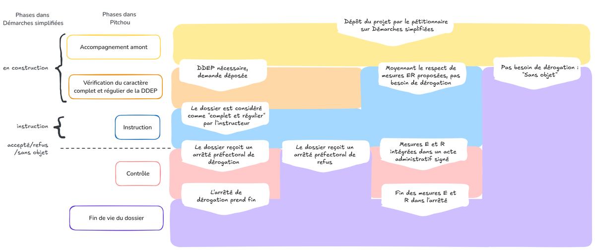

# Phases instructions

A titre liminaire, il convient de préciser que : 
-  En régilme propre, Pitchou n'affiche que l'état de l'instruction concernant la procédure de dérogation à la réglementation espèces protégées, pas l'instruction des PC, PA, déclarations etc...
-  En Autorisation environnementale, Pitchou afiche l'état de l'instruction de l'autorisation environementale dans sa globalité.

## **En régime propre**
Le dossier se trouve dans une des phases suivantes :

- "**Accompagnement amont (hors GUN)**"
    - Dès le premier contact au sujet de son projet, le pétitionnaire est invité à renseigner démarche-numériques (DN). Ce dépôt permet de prendre contact et de garer la mémoire du projet dans les tableaux de suivi Pitchou. Aucune information n'est obligatoire à ce stade et ce dépôt ne signifie pas qu'une demande de déogation est nécessaire.
    - Ce dépôt permet d'obtenir une position officielle du service instructeur :
        - Si aucune DDEP n'est nécessaire, l'instructeur passe le dossier en phase "Classé sans suite" dans Pitchou,
        - Si une DDEP est nécessaire, le pétitionnaire complète sa demande, et celle-ci passe en phase "Etude de recevabilité DDEP".
- "**Étude recevabilité**"
    - Pendant cette phase, le service instructeur évalue le caractère "**complet et régulier**" du dossier et peut demander des compléments. 
    - Lorsque l'instructeur estime que le dossier est complet, il le fait passer dans Pitchou en phase "Instruction".
- "**Instruction**"
    - Le passage en phase d'instruction se fait sous Pitchou, via une action de l'instructeur. Elle concerne toutes les étapes de l'instruction : saisine CSRPN/CNPN, consultation du public, etc. jusqu'à ce qu'une décision administraive soit prise :
         - si la dérogation est **accordée**, l'instructeur fait passer le dossier en phase "Contrôle" dans Pitchou et joint l'arrêté dans l'onglet "Contrôle".
         - si la dérogation est **refusée**, l'instructeur fait passer le dossier en phase "Contrôle" dans Pitchou et joint l'arrêté de refus dans l'onglet "Contrôle".
         - s'il apparaît lors de l'instruction que les mesures E, R et A sont suffisantes et qu'une DDEP n'est pas nécessaire, l'instructeur le formalise via un document (mail, courrier, Arrêté prescrivant les mesures E, R, A et suivi conformémment à la loi DDADUE), ilfait passer le dossier enphase "Contrôle" dans Pitchou et joint la décision admnistrative. 
- "**Contrôle**"
    - Une fois la dérogation accordée, les mesures prescrites peuvent faire l'objet de contrôles pendant toute la durée de vie de l'arrêté. À la fin de la vie de l'arrêté, la dossier passe en phase "Obligations terminées",
- "**Obligations terminées**"
    - Dans cette situation, le pétitionnaire n'a plus d'obligations.
- "**Classé sans suite**"
    - Cette phase a lieu après la phase amont, notammentsi le pétitionnaire abandonne son projet et donc sa DDEP, etc.

## **En Autorisation Environnementale (AE)**
En Autorisation environnementale, les dossiers sont saisis sous GUNEnv.
A ce stade de l'outil, le lien entre GunEnv et Pitchou ne se fait pas, ce qui signifie que l'instructeur doit lui-même saisir son dossier sous DN.

Un dossier se trouve dans une des phases suivantes :

- "**Accompagnement amont (hors GUN)**"
    - Un dossier en AE peut-être en Accompagnement amont, tant qu'il n'est pas déposé dans GunEnv.
- "**Étude recevabilité**"
    - Dès qu'il est déposé dans GunENv, un dossier en AE passe en phase "**Etude recevabilité**"
    - Pendant cette phase, le service instructeur évalue le caractère "**complet et régulier**" du dossier et peut demander des compléments. 
- "**Instruction**"
    - Le passage en phase d'instruction se fait sous Pitchou, **dès le moment où l'instructeur est informé de son passage en instruction dans GunEnv**.
         - si l'AE est **accordée**, l'instructeur fait passer le dossier en phase "Contrôle" dans Pitchou et joint l'arrêté dans l'onglet "Contrôle".
         - si l'AE est **refusée**, l'instructeur fait passer le dossier en phase "Contrôle" dans Pitchou et joint l'arrêté de refus dans l'onglet "Contrôle".
         - s'il apparaît lors de l'instruction que les mesures E, R et A sont suffisantes et qu'une DDEP n'est pas nécessaire, l'instructeur le formalise auprès du service intsructeur, il fait passer le dossier en phase "Contrôle" dans Pitchou et joint l'AP d'AE. 
- "**Contrôle**"
    - Une fois l'AE accordée, les mesures prescrites peuvent faire l'objet de contrôles pendant toute la durée de vie de l'arrêté. À la fin de la vie de l'arrêté, la dossier passe en phase "Obligations terminées",
- "**Obligations terminées**"
    - Dans cette situation, le pétitionnaire n'a plus d'obligations.
- "**Classé sans suite**"
    - Cette phase a lieu après la phase amont, notamment si le pétitionnaire abandonne son projet et donc sa DDEP, etc.

NB: Dans le schéma ci-dessous, "Démarche Numérique" est mentionné sous son ancien nom "Démarches Simplifiées"

